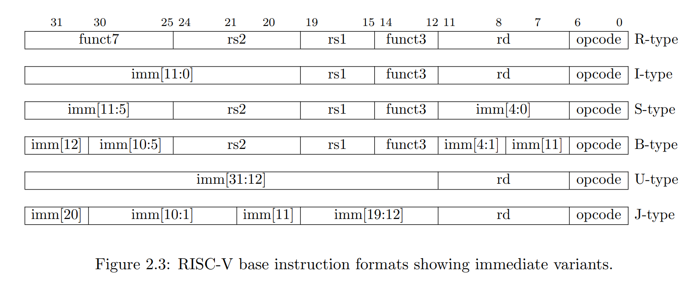

## 汇编语言入门(GNU)

- 一个完整的RISC-V汇编程序有多条`语句(statement)`组成
- 一条典型的RISC-V汇编语句由3部分组成 `statement = [label:][operation][comment]`
- `label:`GNU汇编中，任何以冒号`:`结尾的标识符都被认为是一个标号。
    - 本质上是一个符号地址，地址别名
- `operation`可以有以下多种类型：
    - `instruction`指令：直接对应二进制机器指令的字符串
    - `pseudo-instruction`伪指令，类似与封装一个功能函数或者包含多条指令的脚本
    - `directive`指示/伪操作，以`.`开头，通知汇编器如何控制代码产生等，不对应具体的指令
    - `macro`: 采用 .macro/.endm 自定义的宏
- `comment`：常用方式: `#`开始到当前行结束。

``` s title="First RISC-V Assemble Sample"
.macro do_nothing   # directive
    nop             # pseudo-instruction
    nop             # pseudo-instruction
.endm               # directive

    .text           # directive
    .global _start  # directive

_start:             # Label
    li x6, 5        # pseudo-instruction
    li x7, 4        # pseudo-instruction
    add x5, x6, x7  # instruction
    do_nothing      # Calling macro

stop:   j stop      # statement in one line

    .end            # End of file
```

## RISC-V汇编指令总览

- RISC-V汇编指令操作对象
    - 寄存器
        - 32个通用寄存器，x0~x31 ( RV32I 通用寄存器组)
        - Hart 在执行算术逻辑运算时所操作的数据必须直接来自寄存器
    - 内存
        - Hart 可以执行在寄存器和内存之间的数据读写操作；
        - 读写操作使用`字节（Byte）`为基本单位进行寻址；
        - RV32 可以访问最多 2^32 个字节的内存空间。
- RISC-V汇编指令编码格式
    - 指令长度：ILEN1= 32 bits (RV32I)
    - 指令对齐：IALIGN = 32 bits (RV32I)
    - 32 个 bit 划分成不同的 `“域（field）”`
    - `funct3/funct7`和`opcode`一起决定最终的指令类型
    - 指令在内存中按照`小端序`排列



- RISC-V指令格式 6 种指令格式（format）
    - `R-type:（Register）`，每条指令中有三个 fields，用于指定 3 个 寄存器参数
    - `I-type: Immediate）`，每条指令除了带有两个寄存器参数外，还带有一个立即数参数（宽度为 12 bits）。
    - `S-type: （Store）`，每条指令除了带有两个寄存器参数外，还带有一个立即数参数（宽度为 12 bits，但 fields 的组织方式不同于 I-type）
    - `B-type: (Branch)`，每条指令除了带有两个寄存器参数外，还带有一个立即数参数（宽度为 12 bits，但取值为 2 的倍数）。
    - `U-type: （Upper）`，每条指令含有一个寄存器参数再加上一个立即数参数（宽度为 20  bits，用于表示一个立即数的高 20 位）
    - `J-type: （Jump）`，每条指令含有一个寄存器参数再加上一个立即数参数（宽度为 20  bits）

- RISC-V汇编指令分类
    - 算术运算指令
    - 逻辑运算指令
    - 移位运算指令
    - 内存读写指令
    - 分支与跳转指令
    - ...

### 汇编指令练习

- 对sub执行反汇编，查看`sub x5, x6, x7`这条汇编指令对应的机器指令的编码，并对照RISC-V的specification解析该条指令的编码
- 现知道某条RISC-V的机器指令在内存中的值为`b3 05 95 00`, 从左往右从低地址到高地址，单位为字节，请将其翻译为对应的汇编指令。

## 算术运算指令 (Arithmetic Instructions)

|指令 | 格式   | 语法            | 描述                            | 例子           |
|---  |---    |---              |---                              |---            |
|AND  |R-type |ADD RD,RS1,RS2   |RS1和RS2的值相加，结果保存到RD     |add x5,x6,x7   |
|SUB  |R-type |SUB RD,RS1,RS2   |RS1的值减去RS2的值，结果保存到RD   |sub x5,x6,x7   |
|ADDI |I-type |ADDI RD,RS1,IMM  |RS1的值和IMM相加，结果保存到RD     |addi x5,x6,100 |
|LUI  |U-type |LUI RD,IMM  |构造一个32bit的数，高20bit存放IMM，低12位清零。结果保存到RD|lui x5, 0x12345|
|AUIPC|U-type |AUIPC RD,IMM|构造一个32bit的数，高20bit存放IMM，低12位清零。结果和PC相加后保存到RD|auipc x5, 0x12345|

还有由基本的算术运算指令衍生的伪指令

|指令 | 等价指令    | 语法      | 描述                          | 例子            |
|---  |---         |---        |---                            |---             |
|LI   |LUI + ADDI  |LI RD,IMM  |将立即数IMM加载到RD中           |li x5, 0x12345678|
|LA   |AUIPC + ADDI|LA RD,LABEL|为RD加载一个地址值              |la x5, label     |
|NEG  |SUB RD,x0,RS|NEG RD,RS  |对RS中的值取反并将结果存放在RD中 |neg x5, x6       |
|MV   |ADDI RD,RS,0|MV RD,RS   |将RS中的值拷贝到RD中            |mv x5, x6        |
|NOP  |ADDI x0,x0,0|NOP        |什么也不做                     |nop              |

### ADD

|指令 | 格式   | 语法            | 描述                            | 例子           |
|---  |---    |---              |---                              |---            |
|AND  |R-type |ADD RD,RS1,RS2   |RS1和RS2的值相加，结果保存到RD     |add x5,x6,x7   |

具体编码规则如下：

|funct7 |rs2  |rs1  |funct3|rd   |opcode |
|---    |---  |---  |---   |---  |---    |
|0000000|x7   |x6   |000   |x5   |0110011|
|0000000|00111|00110|000   |00101|0110011|

- 二进制 `0000000-00111-00110-000-00101-0110011`转为16进制为`0x007302B3`，即为可执行文件中的二进制编码
- 注意编译生成的可执行文件的字节序问题：`00 73 02 B3` -> `B3 02 73 00`
- 示例汇编代码：
  
``` s
# Add
# Format:
#   ADD RD, RS1, RS2
# Description:
#   The contents of RS1 is added to the contents of RS2 and the result is 
#   placed in RD.

    .text           # Define beginning of text section
    .global _start  # Define entry _start

_start:
    li x6, 1        # x6 = 1
    li x7, 2        # x7 = 2
    add x5, x6, x7  # x5 = x6 + x7

stop:
    j stop          # Infinite loop to stop execution

    .end            # End of file
```

二进制补码？

- 无符号数 v.s. 有符号数
- 有符号数在计算中的表示：二进制补码(two's complement)
- 符号扩展(Sign extension) v.s. 零扩展(Zero extension)
- 口诀：取绝对值、转二进制、取反+1
- 例如：`-4` 取绝对值、转二进制 -> `100` 取反+1 -> `011+1` `100`
- 符号扩展 `11111-100`
- 零扩展 `00000-100`

``` s
# Add
# Format:
#   ADD RD, RS1, RS2
# Description:
#   The contents of RS1 is added to the contents of RS2 and the result is 
#   placed in RD.

    .text           # Define beginning of text section
    .global _start  # Define entry _start

_start:
    li x6, 1        # x6 = 1
    li x7, -2       # x7 = -2
    add x5, x6, x7  # x5 = x6 + x7

stop:
    j stop          # Infinite loop to stop execution

    .end            # End of file
```

### SUB(Substract)

|指令 | 格式   | 语法            | 描述                            | 例子           |
|---  |---    |---              |---                              |---            |
|SUB  |R-type |SUB RD,RS1,RS2   |RS1的值减去RS2的值，结果保存到RD   |sub x5,x6,x7   |

``` s
# Substract
# Format:
#   SUB RD, RS1, RS2
# Description:
#   The contents of RS2 is subtracted from the contents of RS1 and the result
#   is placed in RD.

    .text           # Define beginning of text section
    .global _start  # Define entry _start

_start:
    li x6, -1       # x6 = -1
    li x7, -2       # x7 = -2
    sub x5, x6, x7      # x5 = x6 - x7

stop:
    j stop          # Infinite loop to stop execution

    .end            # End of file
```

### ADDI(ADD Immediate)

|imm[11:0]     |rs1  |funct3|rd   |opcode |
|---    ---    |---  |---   |---  |---    |
|0000 0000 0000|x6   |000   |x5   |0110011|
|0000 0000 0000|00110|000   |00101|0110011|

### LUI(Load Upper Immediate)

|imm[31:12]              |rd   |opcode |
|---    ---              |---  |---    |
|0000 0000 0000 0000 0000|x5   |0110111|
|0000 0000 0000 0000 0000|00101|0110111|

### AUIPC(ADD Upper Immediate Program Counter)

|imm[31:12]              |rd   |opcode |
|---    ---              |---  |---    |
|0000 0000 0000 0000 0000|x5   |0110111|
|0000 0000 0000 0000 0000|00101|0110111|

### 练习

- 对sub执行反汇编，查看`sub x5, x6, x7`这条汇编指令对应的机器指令的编码，并对照RISC-V的specification解析该条指令的编码
- 现知道某条RISC-V的机器指令在内存中的值为`b3 05 95 00`, 从左往右从低地址到高地址，单位为字节，请将其翻译为对应的汇编指令。

## Reference

- [The RISC-V Instruction Set Manual https://riscv.org/wp-content/uploads/2019/12/riscv-spec-20191213.pdf](https://riscv.org/wp-content/uploads/2019/12/riscv-spec-20191213.pdf)
- [The RISC-V Instruction Set Manual，Volume I: Unprivileged ISA，Document Version 20191213. Using as https://sourceware.org/binutils/docs/as/](https://sourceware.org/binutils/docs/as/)
- [How to Use Inline Assembly Language in C Code](https://gcc.gnu.org/onlinedocs/gcc/Using-Assembly-Language-with-C.html)
