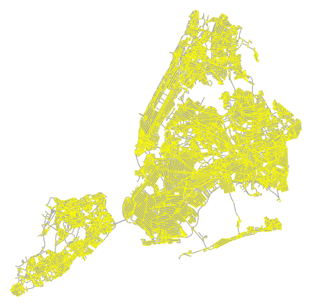
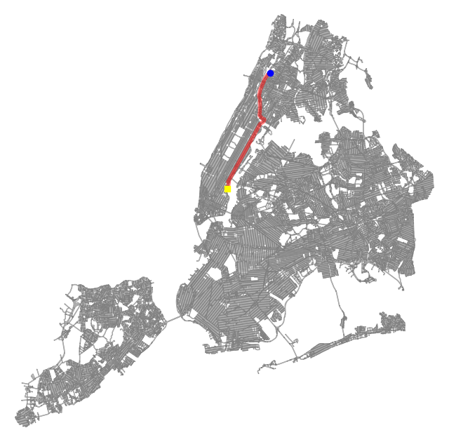
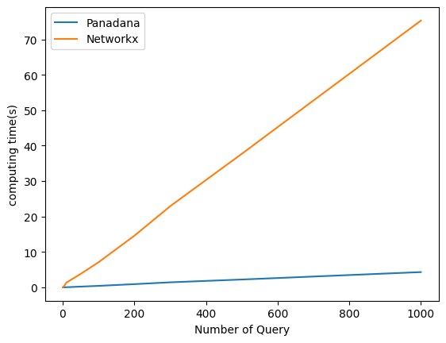

In this series, I will introduce some third-party libraries such as osmnx, pandana, geopandas and compare the performance between **NetworkX(Dijkstra)** and **Pandana( Constraction Hierarchy)**. Finally, I will show how to use these libraries to solve a **Carpool(拼车) problem**. The data set used in this article is from [OpenStreetMap](https://www.openstreetmap.org/) - New York City Taxi Trip data set.

## preliminary

You are highly recommended to use Conda to setup a new virtual environment.

```bash
conda create -n geospatial python==3.8
conda activate geospatial
pip install geopandas network osmnet osmnx pandas pandana
```

If you received an error like "spatialindex_c-64.dll is missing", try to use the following commands to resolve it.

```bash
pip uninstall rtree
pip install rtree
```

```python
import warnings
warnings.filterwarnings('ignore')
warnings.simplefilter('ignore')

import osmnx as ox
import numpy as np
import geopandas as gpd
import pandana
import pandas as pd
from time import time
import matplotlib.pyplot as plt
from IPython.display import display, clear_output
import networkx as nx
import momepy
```

## Data Preparation

```python
def extract_graph(place='New York'):
    # try Chinese
    # G = ox.graph_from_place('纽约', network_type='drive')
    ox.config(log_console=True, use_cache=True)
    G = ox.graph_from_place(place, network_type='drive')
    return G

place = 'New York'
G = extract_graph(place)
ox.plot_graph(G, bgcolor="w", node_size=1, node_color="yellow", edge_color="#aaa")
print("node count:", len(G.nodes()))
print("edge count:", len(G.edges()))
```



There are total node 55344 nodes and 139582 edges.

We process [New York](https://data.cityofnewyork.us/Transportation/NYC-Taxi-Zones/d3c5-ddgc) [New York Taxi Trip](https://www.nyc.gov/site/tlc/about/tlc-trip-record-data.page)  and provide Trips.txt ([Appendix](https://github.com/SheldonCoder1337/sheldoncoder1337.github.io/sources/Shortest-Path/Trips.txt))

Trips.txt contains New York Taxi trajectory information for 10,000 lines, each containing six columns of information, the region name where the passengers are picked up(PName),the lon and lat of the region in which they are picked up(PLon PLat),the region name they are delivered(Dname) and in which the passenger is delivered(DLon DLat).

For example:

|PName|PLon|PLat|DName|DLon|DLat|
|---|---|---|---|---|---|
|Lincoln_Square_East|-73.97382133|40.73788468|Upper_East_Side_North|-73.91715837|40.8541322|
|Upper_East_Side_North|-73.91715837|40.8541322|Central_Harlem_North|-73.99804922|40.71156838|

## Find the Shortest Path

There are two ways to find the shortest path, please check the docs for more details:

1. [NetworkX](https://networkx.org/documentation/stable/reference/algorithms/shortest_paths.html)
2. [Pandana(CH)](https://udst.github.io/pandana/)

### NetworkX(Dijkstra)

```python
# The first trip record is from Lincoln_Square_East to Upper_East_Side_North
nx_Lincoln_Square_East_id = ox.distance.nearest_nodes(G,Lincoln_Square_East_Location.x,Lincoln_Square_East_Location.y)[0]
nx_Upper_East_Side_North_id = ox.distance.nearest_nodes(G,Upper_East_Side_North_Location.x,Upper_East_Side_North_Location.y)[0]

# NetworkX shortest path
def SP_NX(G,SID,TID):
    return nx.shortest_path(G, source=SID, target=TID, method="dijkstra", weight='length')
     
#display
NX_PATH=SP_NX(G,nx_Lincoln_Square_East_id,nx_Upper_East_Side_North_id)    
fig , ax = ox.plot_graph(G, bgcolor="w", node_size=1, node_color="gray", edge_color="#aaa",show=False,close=False)
ax.scatter(-73.97382133,40.73788468,c='yellow',marker="s",alpha=1,zorder=4)
ax.scatter(-73.91715837,40.8541322,c='blue',alpha=1,zorder=3)
ox.plot_graph_route(G,NX_PATH,ax=ax,orig_dest_size=0,route_alpha=0.5,route_colors='r',route_linewidths=2,show=False,close=False)
```


### Pandana(CH)

```python
# trans road network to pandana format
nodes,edges = ox.graph_to_gdfs(G,nodes=True,edges=True)
edges = edges.reset_index()
G_pan = pandana.Network(nodes['x'], nodes['y'], edges['u'], edges['v'], edges[['length']],twoway=False)

# The first trip record is from Lincoln_Square_East to Upper_East_Side_North
Lincoln_Square_East_Location = pd.DataFrame({'longitude':[-73.97382133], 'latitude': [40.73788468]})
Lincoln_Square_East_Location = gpd.points_from_xy(Lincoln_Square_East_Location.longitude, Lincoln_Square_East_Location.latitude, crs="EPSG:4326")

Upper_East_Side_North_Location = pd.DataFrame({'longitude':[-73.91715837], 'latitude': [40.8541322]})
Upper_East_Side_North_Location = gpd.points_from_xy(Upper_East_Side_North_Location.longitude, Upper_East_Side_North_Location.latitude, crs="EPSG:4326")

pan_Lincoln_Square_East_id = G_pan.get_node_ids(Lincoln_Square_East_Location.x,Lincoln_Square_East_Location.y).iloc[0]
pan_Upper_East_Side_North_id = G_pan.get_node_ids(Upper_East_Side_North_Location.x,Upper_East_Side_North_Location.y).iloc[0]

# pandana shortest path
def SP_PAN(G_pan,SID,TID):
    return G_pan.shortest_path(SID,TID)
 
#display
PAN_PATH=SP_PAN(G_pan,pan_Lincoln_Square_East_id,pan_Upper_East_Side_North_id)    
fig , ax = ox.plot_graph(G, bgcolor="w", node_size=1, node_color="gray", edge_color="#aaa",show=False,close=False)
ax.scatter(-73.97382133,40.73788468,c='yellow',marker="s",alpha=1,zorder=4)
ax.scatter(-73.91715837,40.8541322,c='blue',alpha=1,zorder=3)
ox.plot_graph_route(G,PAN_PATH,ax=ax,orig_dest_size=0,route_alpha=0.5,route_colors='r',route_linewidths=2,show=False,close=False)
```



### Comparison

```python
# you should upload trips.txt to your jupyter notebook first 
pickup_name=[]
pickup_lon=[]
pickup_lat=[]
disengaged_name=[]
disengaged_lon=[]
disengaged_lat=[]

import csv
 
# opening the CSV file
with open('trips.txt', mode ='r')as file:
   
  # reading the CSV file
  csvFile = csv.reader(file)
  
  # displaying the contents of the CSV file
  for lines in csvFile:
        pickup_name.append(lines[0])
        pickup_lon.append(lines[1])
        pickup_lat.append(lines[2])
        disengaged_name.append(lines[3])
        disengaged_lon.append(lines[4])
        disengaged_lat.append(lines[5])

pickup_info = pd.DataFrame({'pickup_name':pickup_name,'longitude':pickup_lon, 'latitude': pickup_lat})
disengaged_info = pd.DataFrame({'disengaged_name':disengaged_name,'longitude':disengaged_lon, 'latitude': disengaged_lat})

pickup_Location = gpd.points_from_xy(pickup_info.longitude, pickup_info.latitude, crs="EPSG:4326")
disengaged_Location = gpd.points_from_xy(disengaged_info.longitude, disengaged_info.latitude, crs="EPSG:4326")

pickup_id = G_pan.get_node_ids(pickup_Location.x,pickup_Location.y)
disengaged_id = G_pan.get_node_ids(disengaged_Location.x,disengaged_Location.y)

nx_pickup_id = list(ox.distance.nearest_nodes(G,pickup_Location.x,pickup_Location.y))
nx_disengaged_id = list(ox.distance.nearest_nodes(G,disengaged_Location.x,disengaged_Location.y))

time_PAN=[]
time_NX=[]

test=[1,5,10,50,100,200,300,500,1000] # the query size

NX_BATCH_PATH=[]
PAN_BATCH_PATH=[]

# This is the loop for evaluating the time of NetworkX
for i in range(len(test)):
    
    tik = time()
    for j in range(test[i]): 
        NX_BATCH_PATH.append(nx.shortest_path(G,source=nx_pickup_id[j],target=nx_disengaged_id[j],method='dijkstra',weight='length'))
    
    tok = time()
    time_NX.append(tok-tik)
    print('when query size = ',test[i],end=' , ')
    print('Time of Networkx is : ',time_NX[-1],end='s\n')

# This is the loop for evaluating the time of Pandana
for i in range(len(test)):
    tik = time()
    for j in range(test[i]):
        PAN_BATCH_PATH.append(G_pan.shortest_path(pickup_id[j],disengaged_id[j]))
    
    tok = time()
    time_PAN.append(tok-tik)
    print('when query size = ',test[i],end=' , ')
    print('Time of Pandana is : ',time_PAN[-1],end='s\n')


fig = plt.figure()
ax = fig.add_subplot(1, 1, 1) 
clear_output(wait = True)
ax.plot(test,time_PAN,label='Panadana')
ax.plot(test,time_NX,label='Networkx')
plt.ylabel('computing time(s)')
plt.xlabel('Number of Query')
plt.legend()
fig.show()
```

<!--  -->


/// caption
Here, we use Batch evaluation between Dijkstra (NetworkX) and CH (Pandana), and the results shows that CH algor is much faster than classical Dijskra.
///

Now, we have already learn how to use Networkx and Pandana `shortest_path` API to find the shortest path on [New York](https://data.cityofnewyork.us/Transportation/NYC-Taxi-Zones/d3c5-ddgc) [New York Taxi Trip](https://www.nyc.gov/site/tlc/about/tlc-trip-record-data.page) dataset. And after comparing the performance between Dijkstra and Constraction Hierarchy algorithm, we could found that CH have a much better performance than classic Dijkstra algorithm. let's try to fix the Carpool problem.

## Carpool problem

### Location Statistics & Heat Map Visualization

```python
import pandas as pd
import plotly.express as px

# Data with latitude/longitude and values
df = pd.read_csv('https://raw.githubusercontent.com/R-CoderDotCom/data/main/sample_datasets/population_galicia.csv')

fig = px.density_mapbox(df, lat = 'latitude', lon = 'longitude', z = 'tot_pob',
                        radius = 7,
                        center = dict(lat = 42.83, lon = -8.35),
                        zoom = 6,
                        mapbox_style = 'open-street-map',
                        color_continuous_scale = 'rainbow',
                        opacity = 0.5)
fig.show()
```

## Carpool problem

With the rise of taxi-hailing mobile programs (such as uber), a New York cab driver is used to take orders from online platform. Given the initial location of the driver and 2-3 orders (e.g., each order is a 6-tuple, like a record in the NY Taxi data), your task is to find a feasible route to pick up all the orders.

For instance, the driver is now at location Time Square, he is assigned to pick up three passengers.

- passengerA: JFK_Airport to East_Chelsea
- passengerB: West_Village to East_Chelsea
- passengerC: Battery_Park_City to Queens_Plaza

One feasible solution is to report the route from

- Time Square -> JFK_Airport -> East_Chelsea -> West_Village -> East_Chelsea -> Battery_Park_City -> Queens_Plaza

### Our target

1) Write a function to determine the route and the total distance of the route.
2) Plot the route on the map.

Obviously, the feasible solution is far from optimal as East_Chelsea is the common locations of two pessagers. Thereby,  

### Bonus task

- Try to find the best route based on the given orders. For the bonus part, please explain your methodology and your mark will be given based on the soundness of your idea, the quality of analysis, and the implementation.

```python

```
