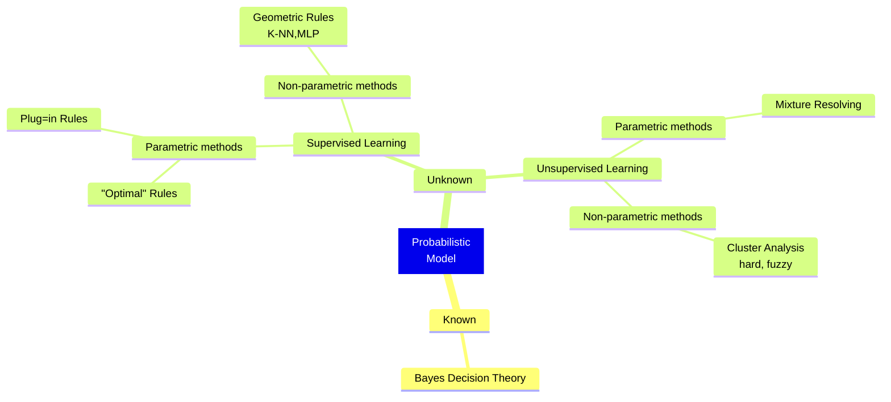

# Classification using Bayes Decision Theory

## Statistics Model

```mermaid
mindmap
  root[Probabilistic <br> Model]
    Known
      Bayes Decision Theory
    Unknown
      Supervised Learning
        Parametric methods
            "Optimal" Rules
            Plug=in Rules
        Non-parametric methods
            Geometric Rules <br> K-NN,MLP
      Unsupervised Learning
        Parametric methods
            Mixture Resolving
        Non-parametric methods
            Cluster Analysis <br> hard, fuzzy
```
