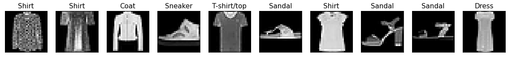

```python
# load necessary libraries
import torch
import torchvision
from torch import nn
from torch.utils.data import DataLoader
from torchvision import datasets
from torchvision.transforms import ToTensor, Lambda, Compose
import matplotlib.pyplot as plt
from time import time

# print(torch.__version__)
# print(torchvision.__version__)
```

The Dataset used in this tutorial

`Fashion-MNIST` is a dataset of Zalando’s article images consisting of of 60,000 training examples and 10,000 test examples. Each example comprises a 28×28 grayscale image and an associated label from one of 10 classes.

```python
# download FashionMNIST dataset
training_data = datasets.FashionMNIST(
    root="data",
    train=True,
    download=True,
    transform=ToTensor() # ToTensor() transforms the data to tensor type and rescale [0,255] uint8 to [0,1] float
)

# Download test data from open datasets.
test_data = datasets.FashionMNIST(
    root="data",
    train=False,
    download=True,
    transform=ToTensor()
)

# print(dir(training_data)) # print all attribute of an object
# print(training_data.data[0,:]) # print info of the first picture
# plt.imshow(training_data.data[0,:], cmap=plt.get_cmap('gray')) # visualize the first picture
```

## Step 1: Prepare Data

```python
batch_size = 128
# print(training_data.data[0,:])

# Create data loaders.
train_dataloader = DataLoader(training_data, batch_size=batch_size, shuffle=True)
test_dataloader = DataLoader(test_data, batch_size=batch_size)

# check the first batch of the dataset
for X, y in test_dataloader:
    print("Shape of X [N, C, H, W]: ", X.shape, X.dtype) # 
    print("Shape of y: ", y.shape, y.dtype)
    break
    
# N: number of data instance in a batch
# C: channel, number of colors in a pixel here
# [H, W]: Height and width of a picture
```

```txt
Shape of X [N, C, H, W]:  torch.Size([128, 1, 28, 28]) torch.float32
Shape of y:  torch.Size([128]) torch.int64
```

```python
# visualize sample images
nsamples=10
classes_names = ['T-shirt/top', 'Trouser', 'Pullover', 'Dress', 'Coat', 'Sandal','Shirt', 'Sneaker', 'Bag', 'Ankle boot']
imgs, labels = next(iter(train_dataloader))

fig=plt.figure(figsize=(20,5),facecolor='w')
for i in range(nsamples):
    ax = plt.subplot(1,nsamples, i+1)
#     print(imgs[i, 0, :, :])
    plt.imshow(imgs[i, 0, :, :], cmap=plt.get_cmap('gray'))
    ax.set_title("{}".format(classes_names[labels[i]]), fontsize=15)
    ax.get_xaxis().set_visible(False)
    ax.get_yaxis().set_visible(False)

plt.show()
```



## Step 2: Define Neural Nets

```python
class MyModel(nn.Module):
    def __init__(self):
        super(MyModel, self).__init__()
        self.linear_relu_stack = nn.Sequential(
            # This is how your layers are defined and stacked sequentially
            nn.Flatten(), # given an image of size 28x28, it will be flattened to a vector of size 784 # reshape the input to 1D (a very long vector)
            nn.Linear(784, 128), # 784×128 parameters
            nn.ReLU(), # if negative, it becomes 0
            nn.Dropout(0.2),
            nn.Linear(128, 10), # 128×10 output 128 layers and 10 labels
            nn.Sigmoid() 
        )

    def forward(self, x):
        y = self.linear_relu_stack(x)
        return y

model = MyModel()
print(model)
```

```txt
MyModel(
  (linear_relu_stack): Sequential(
    (0): Flatten(start_dim=1, end_dim=-1)
    (1): Linear(in_features=784, out_features=128, bias=True)
    (2): ReLU()
    (3): Dropout(p=0.2, inplace=False)
    (4): Linear(in_features=128, out_features=10, bias=True)
    (5): Sigmoid()
  )
)
```

## Step 3: Define loss function and the optimizer

```python
# define a loss function you want to optimize 
loss_fn = nn.CrossEntropyLoss()

# define an optimizer
optimizer = torch.optim.Adam(model.parameters()) # Adam: A Method for Stochastic Optimization
```

## Step 4: Train the neural nets

```python
# epochs: how many times we would like to traverse the whole dataset
epochs=5

for i in range(epochs): # iterate over epochs
    tic = time()
    model.train()
    train_loss=0
    for j, (X, y) in enumerate(train_dataloader): # iterate over batches 
        # Compute prediction error
        pred = model(X)
        loss = loss_fn(pred, y)
        train_loss += loss.item()
        # Backpropagation
        optimizer.zero_grad()
        loss.backward()
        optimizer.step()

        # print learning process every 100 batches
        if j % 100 == 0:
            loss, current = loss.item(), j * len(X)
            print(f"epoch {i} batch {j} loss: {loss/batch_size:>7f}")
    
    train_time = time() - tic
    
    # print test results after every epochs    
    with torch.no_grad():
        model.eval()
        test_loss=0
        hit=0
        for (X, y) in test_dataloader:
            pred = model(X)
            test_loss += loss_fn(pred, y).item()
            hit += (pred.argmax(1) == y).sum().item()
        print(f"epoch {i} training time: {train_time:>3f}s, train loss: {train_loss/len(train_dataloader.dataset):>7f} test loss: {test_loss/len(test_dataloader.dataset):>7f} accuracy: {hit/len(test_dataloader.dataset) :>7f}")    
```

```txt
epoch 0 batch 0 loss: 0.017987
epoch 0 batch 100 loss: 0.013263
epoch 0 batch 200 loss: 0.013020
epoch 0 batch 300 loss: 0.013196
epoch 0 batch 400 loss: 0.012888
epoch 0 training time: 3.524010s, train loss: 0.013305 test loss: 0.012916 accuracy: 0.587600
epoch 1 batch 0 loss: 0.012708
epoch 1 batch 100 loss: 0.012738
epoch 1 batch 200 loss: 0.012615
epoch 1 batch 300 loss: 0.012646
epoch 1 batch 400 loss: 0.012460
epoch 1 training time: 3.451036s, train loss: 0.012682 test loss: 0.012763 accuracy: 0.617100
epoch 2 batch 0 loss: 0.012583
epoch 2 batch 100 loss: 0.012776
epoch 2 batch 200 loss: 0.012628
epoch 2 batch 300 loss: 0.012702
epoch 2 batch 400 loss: 0.012469
epoch 2 training time: 3.448095s, train loss: 0.012553 test loss: 0.012686 accuracy: 0.642400
epoch 3 batch 0 loss: 0.012615
epoch 3 batch 100 loss: 0.012434
epoch 3 batch 200 loss: 0.012553
epoch 3 batch 300 loss: 0.012463
epoch 3 batch 400 loss: 0.012621
epoch 3 training time: 3.463367s, train loss: 0.012486 test loss: 0.012625 accuracy: 0.650900
epoch 4 batch 0 loss: 0.012159
...
epoch 4 batch 200 loss: 0.012609
epoch 4 batch 300 loss: 0.012223
epoch 4 batch 400 loss: 0.012312
epoch 4 training time: 3.480916s, train loss: 0.012431 test loss: 0.012592 accuracy: 0.666100
```

## Try Different Network Structure

- linear model with NO hidden layer, No dropout, No non-linearity activation

```python
class ShallowModel(nn.Module):
    def __init__(self):
        super(ShallowModel, self).__init__()
        self.linear_stack = nn.Sequential(
            nn.Flatten(),
            nn.Linear(28*28, 10),
            nn.Sigmoid()
        )

    def forward(self, x):
        y = self.linear_stack(x)
        return y
    
model = ShallowModel()
print(model)

# define a loss function you want to optimize 
loss_fn = nn.CrossEntropyLoss()

# define an optimizer
optimizer = torch.optim.Adam(model.parameters()) 
```

- two hidden layers with 128 neurons and 32 neurons
  - Activation Relu
  - Dropout 0.2

```python
class DeepModel(nn.Module):
    def __init__(self):
        super(DeepModel, self).__init__()
        self.linear_relu_stack = nn.Sequential(
            nn.Flatten(),
            nn.Linear(28*28, 128),
            nn.ReLU(),
            nn.Dropout(0.2),
            nn.Linear(128, 32),
            nn.ReLU(),
            nn.Dropout(0.2),
            nn.Linear(32, 10),
            nn.Sigmoid()
        )

    def forward(self, x):
        y = self.linear_relu_stack(x)
        return y

model = DeepModel()
print(model)
```
