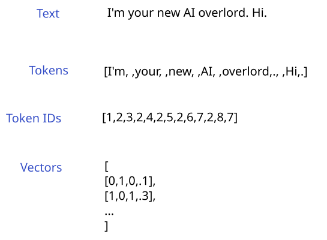
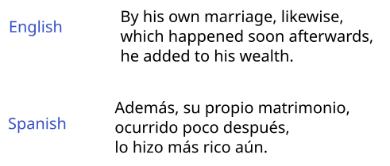
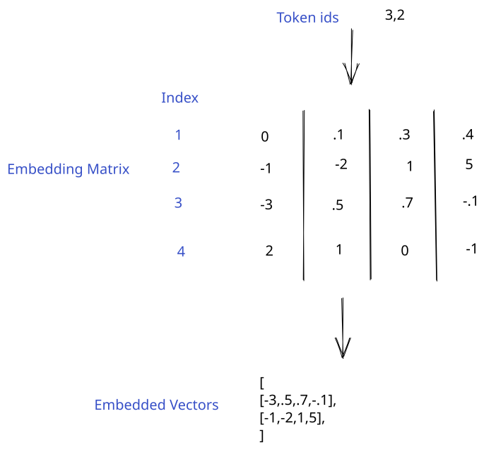
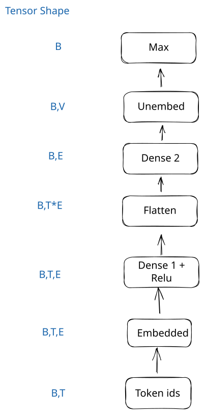
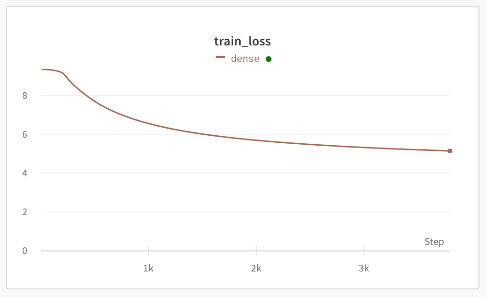

# Working with text

In this lesson, we'll learn how to work with text input to neural networks.  This is necessary to build a language model like GPT.

Neural networks can't understand text directly, so we need to convert the text into a numerical representation.  How we choose to represent the text can give the model a lot of useful information, and result in better predictions.

The steps in converting text to a numerical representation are:

1. Tokenize the text to convert it into discrete tokens (kind of like words)
2. Assign a number to each token
3. Convert each token id into a vector representation.  This is called embedding.

We can then feed the vectors into a neural network layer.  Here's a diagram:



You might be wondering why we don't directly feed the token ids into the neural network.

Embedding enables the network to learn similarities between tokens.  For example, the token id for a `.` might be `2`, and the id for a ` ` might be `7`.  This doesn't help the network understand the relationship between the two tokens.  However, if the vector for a `.` is `[0,1,.1,2]`, and the vector for a ` ` is `[0,1,.1,1]`, the distance between the vectors could indicate that the tokens are similar in their function.  Like weights, the embeddings are learned by the network, and will change during training.  Tokens that are conceptually similar will have vectors that are closer together than tokens that aren't.

## Load and process the data

We'll be working with a dataset from [Opus books](https://huggingface.co/datasets/opus_books/viewer/en-es/train).  This dataset contains English sentences from books, and their Spanish translations.  We'll use the translation in the next lesson, but in this one, we'll only use the English sentence.

There are about 24k sentence pairs in the dataset.  Here's an example:



These sentences in very Old(e) English, but that won't stop our AI from parsing them.  We'll first load in the data using `pandas` and explore it:

```python
import pandas as pd

# This file is in the repo if you clone it
opus = pd.read_csv("../data/opus_books.csv")
opus.head()
```

<div>
<style scoped>
    .dataframe tbody tr th:only-of-type {
        vertical-align: middle;
    }

    .dataframe tbody tr th {
        vertical-align: top;
    }

    .dataframe thead th {
        text-align: right;
    }
</style>
<table border="1" class="dataframe">
  <thead>
    <tr style="text-align: right;">
      <th></th>
      <th>en</th>
      <th>es</th>
    </tr>
  </thead>
  <tbody>
    <tr>
      <th>0</th>
      <td>In the society of his nephew and niece, and th...</td>
      <td>En compañía de su sobrino y sobrina, y de los ...</td>
    </tr>
    <tr>
      <th>1</th>
      <td>By a former marriage, Mr. Henry Dashwood had o...</td>
      <td>De un matrimonio anterior, el señor Henry Dash...</td>
    </tr>
    <tr>
      <th>2</th>
      <td>By his own marriage, likewise, which happened ...</td>
      <td>Además, su propio matrimonio, ocurrido poco de...</td>
    </tr>
    <tr>
      <th>3</th>
      <td>But the fortune, which had been so tardy in co...</td>
      <td>Pero la fortuna, que había tardado tanto en ll...</td>
    </tr>
    <tr>
      <th>4</th>
      <td>But Mrs. John Dashwood was a strong caricature...</td>
      <td>Pero la señora de John Dashwood era una áspera...</td>
    </tr>
  </tbody>
</table>
</div>

### Create our vocabulary

Now, we need to clean the data and define our token vocabulary.  Our vocabulary is how we map each token to a unique token id.  We'll be creating our own very simple tokenizer and vocabulary.  In practice, you'll use more powerful tokenizers like byte-pair encoding that look at sequences of characters to find the optimal tokenization scheme.

Optimal means accurate and fast.  For example, we could look at individual characters (`a`, `b`, etc) instead of tokens.  This would result in a much smaller vocabulary (and run faster), but it would be much less accurate, since the model would get less information about entire words and concepts.

We'll first setup some special tokens, that the system will use:

- `<PAD>` - this token is used to pad sequences to a given length.  When we're working with text data, sentences won't all be the same length.  However, a neural network needs all rows in a batch to have the same number of columns.  Padding enables us to make all sentences the same length.  We use a special token for this, and tell the network to ignore it in the backward pass.
- `<UNK>` - some tokens don't occur often enough to add them to our vocabulary.  Imagine words like `Octothorpe`, or issues with data quality like `hello123bye`.  These long-tail words will add a lot to our vocabulary (and make our model slower), but don't add much value to the model.  More powerful tokenizers will split these up into individual characters, but in our simple tokenizer, we need `UNK`.
- `<BOS>` - this special token is used to mark the beginning of a sentence, or a sequence.
- `<EOS>` - used to mark the end of a sequence.  It helps the network understand when to stop generating text.

Some tokenizers, like the GPT-2 tokenizer, don't have `BOS` and `EOS`, and use `PAD` instead.

```python
import re
from collections import defaultdict

special_tokens = {
    "<PAD>": 0,
    "<UNK>": 1,
    "<BOS>": 2,
    "<EOS>": 3
}
vocab = special_tokens.copy()
```

Next, we'll define our functions to clean and tokenize input text.  We're going to do some naive cleaning, and just strip anything that isn't in a small set of characters (letters, numbers, spaces, some punctuation).  We're doing this because our simple tokenizer needs a very small character set (a large character set will result in a larger vocabulary).  As you'll see later, the size of the vocabulary impacts the size of the embedding matrix, and thus the performance of the network.

Our tokenization will just split on whitespace and punctuation.  We'll set a limit on how many tokens we want per sentence for performance reasons.  Any sentences that are shorter will be padded on the left with the `<PAD>` token.

```python
# This is the maximum numbers of tokens we'll keep from each sentence.  You can increase this, but training will take longer.
token_limit = 11

def clean(text):
    # Use re to replace punctuation that is not a comma, question mark, or period with spaces
    text = re.sub(r'[^\w\s,?.!]',' ', text)
    # Strip leading/trailing space
    text = text.strip()
    return text

def tokenize(text):
    # Split on consecutive whitespace and punctuation
    tokens = re.findall(r'\w+|[^\w\s]+|[\s]+', text)

    # Pad sentences that are too short
    if len(tokens) < token_limit:
        pad_count = token_limit - len(tokens)
        tokens = ["<PAD>"] * pad_count + tokens

    # Only take tokens up to the limit
    tokens = tokens[:token_limit]
    return tokens
```

```python
# Example tokenization
tokenize("This sentence is okay.")
```

    ['<PAD>',
     '<PAD>',
     '<PAD>',
     'This',
     ' ',
     'sentence',
     ' ',
     'is',
     ' ',
     'okay',
     '.']

We can now create a vocabulary using our functions.  We'll first create a dictionary containing every token in our sentences, and the number of times it appears across the dataset.  Then, we'll create a vocab dictionary, only selecting the tokens that appear more than once.  Tokens that only appear once will be marked as unknown.

```python
opus_tokens = defaultdict(int)

# Loop through the sentences, clean, tokenize, and assign token counts
for index, row in opus.iterrows():
    cleaned = clean(row["en"])
    tokens = tokenize(cleaned)
    for token in tokens:
        opus_tokens[token] += 1

# Set to the current size of the vocabulary (special tokens)
counter = len(vocab)
# Assign a unique id to each token if it appears more than once
for index, token in enumerate(opus_tokens):
    # Filter out uncommon tokens
    # Add unknown token for rare words
    if opus_tokens[token] > 1:
        vocab[token] = counter
        counter += 1
    else:
        vocab[token] = 1 # Assign unknown id
```

```python
len(vocab)
```

    11731

We have about 11k tokens in our vocabulary.  In practice, tokenizers will usually have between 10k and 100k tokens.  This is a good tradeoff between thoroughness (having a unique id for every word), and vocabulary size (splitting some rare words into multiple tokens).  The GPT-2 tokenizer uses 50257 tokens.

We'll also build a reverse vocab lookup, which we can use to decode token ids to tokens:

```python
reverse_vocab = {v: k for k, v in vocab.items()}

# Several tokens could be mapped to the <UNK> token id, so make sure we set the reverse mapping correctly
for k, v in special_tokens.items():
    reverse_vocab[v] = k
```

### Tokenize sentences

We can now use our vocabulary to tokenize our sentences.  We'll create an encode function, that can turn a sentence into a torch tensor of token ids.

We'll also write a decode function.  This will use a reverse lookup to go from token id to token.  This will enable us to decode our predictions and see how good they were.

```python
import torch

def encode(text):
    # Yokenize input text
    tokens = tokenize(clean(text))
    # Convert to token ids
    encoded = torch.tensor([vocab[token] for token in tokens])
    return encoded

def decode(encoded):
    # The input is a torch tensor - convert it to a list
    encoded = encoded.detach().cpu().tolist()
    # Decode a list of integers into text
    decoded = "".join([reverse_vocab[token] for token in encoded])
    return decoded
```

Now, we can use the encode function to convert our English sentences into token ids:

```python
tokenized = []
for index, row in opus.iterrows():
    # Encode the English sentences
    en_text = row["en"]
    en = encode(en_text)
    tokenized.append(en)
```

```python
tokenized[0]
```

    tensor([ 4,  5,  6,  5,  7,  5,  8,  5,  9,  5, 10])

### Create torch dataset

Once we have our encoded vectors, we'll need to create a torch dataset with the input tokens (first 10 tokens of each sentence), and the token we want to predict (token 11).

This is similar to what we did in the [last lesson](https://github.com/VikParuchuri/zero_to_gpt/blob/master/explanations/pytorch.ipynb) when we created a dataset to use in training.

We'll also create a DataLoader, which will enable us to batch our data for better performance.  If multiple sentences are batched together, the whole batch will be processed at once, versus serially.  The tradeoff is higher memory usage (the whole batch has to fit into memory at once, as do the intermediate values/gradients).  But this data is small enough that it won't matter if we use a high batch size.

```python
from torch.utils.data import DataLoader, Dataset

class TextData(Dataset):
    """
    A torch dataset that stores encoded text data.
    """
    def __init__(self, data):
        # The input is a list of torch tensors.  We need to stack them into a 2-D tensor.
        self.tokens = torch.vstack(data).long()

    def __len__(self):
        # Return how many examples are in the dataset
        return len(self.tokens)

    def __getitem__(self, idx):
        # Return a single training example
        x = self.tokens[idx][:10]
        y = self.tokens[idx][10]
        return x, y

# Initialize the dataset
train_ds = TextData(tokenized)
# Initialize dataloader with a high batch size
train = DataLoader(train_ds, batch_size=16)
```

```python
# Look at the first element of the dataset
train_ds[0]
```

    (tensor([4, 5, 6, 5, 7, 5, 8, 5, 9, 5]), tensor(10))

```python
# The dataloader is an iterator
# next(iter()) will get the first batch
batch = next(iter(train))
batch
```

    [tensor([[ 4,  5,  6,  5,  7,  5,  8,  5,  9,  5],
             [11,  5, 12,  5, 13,  5, 14, 15,  5, 16],
             [11,  5,  9,  5, 18,  5, 14, 15,  5, 19],
             [20,  5,  6,  5, 21, 15,  5, 22,  5, 23],
             [20,  5, 24, 17,  5, 25,  5, 26,  5, 27],
             [28,  5, 29,  5, 30,  5, 31, 15,  5, 32],
             [33,  5, 27,  5, 34,  5, 35,  5, 36, 37],
             [33,  5, 27,  5,  1, 15,  5, 39, 15,  5],
             [41,  5, 42, 15,  5, 43,  5, 44, 15,  5],
             [45,  5, 46,  5, 47,  5, 48,  5, 49,  5],
             [50,  5, 51,  5,  8,  5, 52,  5, 22,  5],
             [41, 15,  5, 54, 15,  5, 27,  5, 55,  5],
             [57,  5,  1,  5, 32,  5, 12,  5, 58,  5],
             [24, 17,  5, 25,  5, 26,  5, 60,  5, 61],
             [62,  5, 63,  5, 64,  5, 65,  5, 66,  5],
             [68,  5, 69,  5, 70,  5, 71,  5, 72,  5]]),
     tensor([10, 17, 15,  5,  5,  5, 38, 40,  6, 32, 53, 56, 59,  5, 67, 73])]

As you can see above, the DataLoader automatically batches our data together.  The input tokens are 2-dimensional with the shape `(B, T)` where `B` is the size of the batch, and `T` is the number of tokens in each input sentence.  Our prediction target is one-dimensional, with shape `B`.

## Training our network

We now have a sequence of token ids for each sentence.  In order to train a network to predict the next token, we first need to embed each token into a vector representation.

### Embedding layer

We can use an embedding layer for this.  An embedding layer works like this:

- Define an embedding size.  This is the length of the embedding vector for each token.  This is similar to the number of predictor columns in earlier lessons.  Think of each item in the embedding vector as a predictor the network can use.  The higher the embedding size, the more nuance the network can pick up in each token, at the cost of higher memory usage and slower performance.
- Create a matrix of size (vocab_size, embedding_size) and randomly initialize it.  This will create a separate unique embedding vector for each token id.
- In the forward pass, index the matrix to lookup the vector associated with the token id.



In the backward pass, the gradient will be used to adjust the embedding matrix, just like weights are updated in dense layers.  This means that tokens that have similar meanings will end up with vectors that are close together.

```python
import math
from torch import nn

class Embedding(nn.Module):
    """
    Embedding layer
    """
    def __init__(self, vocab_size, embed_dim):
        super().__init__()

        # Create the embedding weights
        k = 1/math.sqrt(embed_dim)
        self.weights =  torch.rand(vocab_size, embed_dim) * 2 * k - k
        self.weights[0] = 0 # Zero out the padding embedding
        # Using nn.Parameter tells torch to update this value in the backward pass
        self.weights = nn.Parameter(self.weights)

    def forward(self, token_ids):
        # Return a matrix of embeddings, one row per token id
        # The final shape will be (batch_size, token_count, embed_dim)
        # We could convert token_ids to a one_hot vector and multiply by the weights, but it is the same as selecting a single row of the matrix
        return self.weights[token_ids]
```

We can also look at the embedding vector for an individual token:

```python
token_id = vocab["society"]
with torch.no_grad():
    input_embed = Embedding(len(vocab), 256)
    print(input_embed.weights[7][:10])
```

    tensor([-0.0568,  0.0450,  0.0384,  0.0089,  0.0463,  0.0432,  0.0406, -0.0300,
             0.0403, -0.0229], requires_grad=True)
    

We can also look at how embedding works for a batch in the forward pass:

```python
with torch.no_grad():
    print(input_embed(batch[0])[0][0][:20])
```

    tensor([-0.0145, -0.0502, -0.0270,  0.0477,  0.0186,  0.0531, -0.0056, -0.0390,
             0.0407,  0.0004, -0.0343,  0.0387,  0.0329,  0.0418, -0.0130, -0.0592,
            -0.0319, -0.0072, -0.0493, -0.0263])
    

After the forward pass of the embedding layer, we end up with a 3-dimensional torch tensor with the shape `(B,T,E)`:

- Dimension 0, `B`, is the batch dimension - one entry per element in the batch.  The length is the same as batch size.
- Dimension 1, `T`, is the token dimension - one entry per input token.  The length is the number of input tokens (10).
- Dimension 2, `E`, is the embedding dimension - one entry per element in the embedding vectors.  The length is the embedding dimension (256).

### Predict the next token

We can now define a neural network that will predict the next token. It will be very similar to the networks we've built in past lessons.  The main difference will at the end of the network, when we make the final prediction.  We want the network to look at all tokens (the full sentence) when it predicts the next token.  To do this, we have to combine all embedding vectors into a single vector before the final layer.

This network is doing classification, where the potential classes are the tokens in our vocabulary.  Our network will output the likelihood it assigns to the next token being each of the 11k items in our vocabulary.  We'll take the largest value as our prediction.

The architecture will be:

Start with a list of token ids.  The shape will be `(B, T)` where `B` is the batch size, and `T` is the number of tokens.

- Embedding layer - from `(B,T)` to `(B,T,E)` where `E` is the embedding dimension
- Dense layer - `(B,T,E)` to `(B,T,E)`
- relu - nonlinear activation - `(B,T,E)` to `(B,T,E)`
- Flatten - this will compress all token embeddings into one vector per batch element - `(B,T,E)` to `(B,T * E)`
- Output layer - get the final token vector prediction -`(B,T * E)` to `(B,E)`
- "Unembed" the vector - `(B,E)` to `(B,V)` where `V` is the vocabulary size



We could apply softmax like we did in the [classification lesson](https://github.com/VikParuchuri/zero_to_gpt/blob/master/explanations/classification.ipynb) to get the probabilities that our next token is each token in the vocabulary.  But, the index of the largest element in the vector before and after the softmax will be the same (softmax preserves the relative order of the probabilities).  So we can just find the index of the largest element, and that will be our predicted token.

```python
class TokenPredictor(nn.Module):
    def __init__(self, vocab_size, input_token_count, hidden_units):
        super().__init__()

        torch.manual_seed(0)
        # Embed the token ids
        self.embedding = Embedding(vocab_size, hidden_units)
        self.dense1 = nn.Linear(hidden_units, hidden_units)
        self.relu = nn.ReLU()

        # Output layer looks at all embedding vectors and generates a prediction
        self.output = nn.Linear(hidden_units * input_token_count, hidden_units)

    def forward(self, x):
        # Embed from (token_count, vocab_size) to (token_count, hidden_size)
        embedded = self.embedding(x)
        # Run the network
        x = self.relu(self.dense1(embedded))
        # Flatten the vectors into one large vector per sentence for the final layer
        flat = torch.flatten(x, start_dim=1)
        # Run the final layer to get an output
        network_out = self.output(flat)
        # Unembed, convert to (batch_size, vocab_size).  Argmax against last dim gives predicted token
        out_vector = network_out @ self.embedding.weights.T
        return out_vector
```

After we define our network, we can write a training loop.

We'll use [CrossEntropyLoss](https://pytorch.org/docs/stable/generated/torch.nn.CrossEntropyLoss.html) from PyTorch, since we're doing classification.  This works like the negative log likelihood that we covered in the [classification lesson](https://github.com/VikParuchuri/zero_to_gpt/blob/master/explanations/classification.ipynb).

We'll make a prediction in the forward pass, measure loss, and then run the backward pass with the loss.

```python
from statistics import mean

# Initialize W&B
%env WANDB_SILENT=True

import wandb
wandb.login()

def train_loop(net, optimizer, epochs):
    # Initialize a new W&B run
    wandb.init(project="text",
               name="dense")

    # We're doing classification, so we use crossentropy loss.
    loss_fn = nn.CrossEntropyLoss(ignore_index=0)
    train_losses = []
    for epoch in range(epochs):
        for batch, (x, y) in enumerate(train):
            # zero_grad will set all the gradients to zero
            # We need this because gradients will accumulate in the backward pass
            optimizer.zero_grad()
            # Make a prediction using the network
            pred = net(x)
            # Calculate the loss
            loss = loss_fn(pred, y)
            # Call loss.backward to run backpropagation
            loss.backward()
            # Step the optimizer to update the parameters
            optimizer.step()
            train_losses.append(loss.item())

            if batch % 10 == 0:
                # Log training metrics
                wandb.log({
                    "train_loss": mean(train_losses)
                })

    return train_losses
```

    env: WANDB_SILENT=True
    

Once we have our training loop, we can run our network.  We'll use regular SGD for our optimizer.  Adjust the number of epochs down if you want it to run faster.

```python
# Define our hyperparameters
epochs = 50
lr = 1e-3

# Initialize our network
net = TokenPredictor(len(vocab), 10, 256)
# Optimizer
optimizer = torch.optim.SGD(net.parameters(), lr=lr)
losses = train_loop(net, optimizer, epochs)
```

You can check the W&B dashboard to see the loss curve and other training information:



The network isn't perfect, due to the architecture (more on that later).  You can try tweaking the parameters and layers to see if you can improve accuracy.

We can also generate predictions using our network, and compare to the actual values:

```python
with torch.no_grad():
    batch = next(iter(train))
    pred = net(batch[0])
    token_id = pred.argmax(-1)

    for i in range(len(batch[0])):
        text = decode(batch[0][i])
        actual = decode(batch[1][i:(i+1)])
        pred = decode(token_id[i:(i+1)])
        print(f"{text}<ACTUAL>{actual}<><PRED>{pred}<>")
```

    In the society of his <ACTUAL>nephew<><PRED><UNK><>
    By a former marriage, Mr<ACTUAL>.<><PRED>,<>
    By his own marriage, likewise<ACTUAL>,<><PRED> <>
    But the fortune, which had<ACTUAL> <><PRED> <>
    But Mrs. John Dashwood was<ACTUAL> <><PRED> <>
    Marianne s abilities were, in<ACTUAL> <><PRED> <>
    She was sensible and clever  <ACTUAL>but<><PRED><UNK><>
    She was <UNK>, amiable, <ACTUAL>interesting<><PRED>that<>
    Elinor saw, with concern, <ACTUAL>the<><PRED>the<>
    They encouraged each other now <ACTUAL>in<><PRED><UNK><>
    The agony of grief which <ACTUAL>overpowered<><PRED><UNK><>
    Elinor, too, was deeply <ACTUAL>afflicted<><PRED><UNK><>
    A <UNK> in a place <ACTUAL>where<><PRED><UNK><>
    Mrs. John Dashwood did not<ACTUAL> <><PRED> <>
    To take three thousand pounds <ACTUAL>from<><PRED><UNK><>
    How could he answer it <ACTUAL>to<><PRED><UNK><>

## Wrap-up

In this lesson, we learned how to convert text into a representation that is appropriate for a neural network.  But the neural network we built isn't very accurate.  This is because it isn't using an optimal architecture.  Our dense network isn't able to look at relationships between tokens efficiently. We aren't able to scale the layers or data effectively as a result.

The optimal architecture for predicting the next token is a transformer.  The good news is that we now have the building blocks we need to create a transformer model.  In the next lesson, we'll do exactly that.
