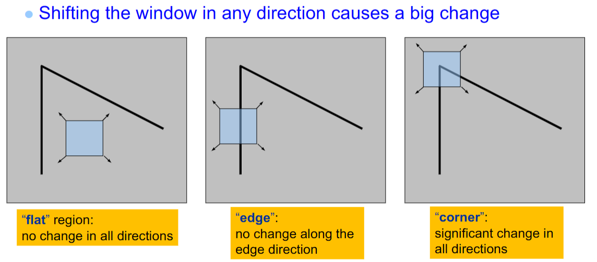
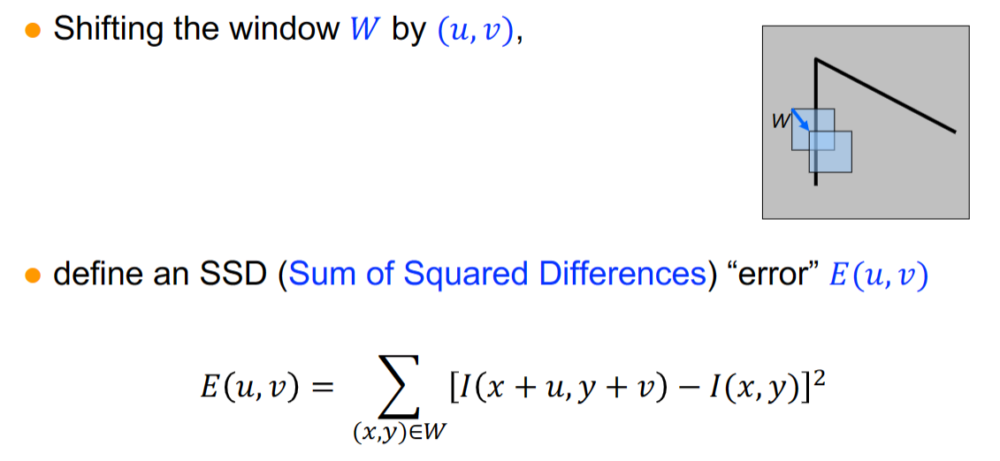
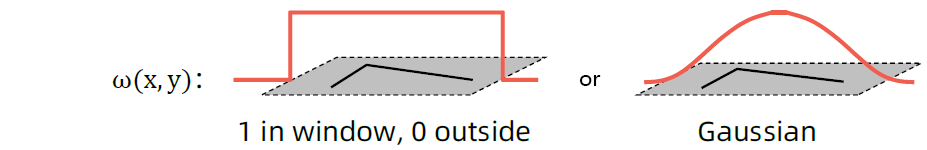

# Harris Corner Detection

## Intuitive perspective





## Mathematic perspective

$$
\text{Definition: }E(u,v)=\sum_{(x,y)\in W}{w(x,y)}[I(x+u,y+v)-I(x,y)]^2 \tag{a}
$$

$$
\text{According to Taylor series: }f(x+h)=f(x)+h\frac{\partial f}{\partial x}(x)+\frac{h^{2}}{2}\frac{\partial f}{\partial x^{2}}(x)+\cdots
$$

$$
I(x+u,y+v)\approx I(x,y)+\frac{\partial I}{\partial x}u+\frac{\partial I}{\partial y}v
$$

$$
\begin{align*}
    E(u,v) &=\sum_{(x,y)\in W}{w(x,y)}[I(x+u,y+v)-I(x,y)]^2 \tag{a}
    \\
        &\approx \sum_{(x,y)\in W}{w(x,y)}\Big[I(x,y)+\frac{\partial I}{\partial x}u+\frac{\partial I}{\partial y}v-I(x,y)\Big]^{2}
    \\
        &= \sum_{(x,y)\in W}{w(x,y)}\left[I_{x}u+I_{y}v\right]^{2} \tag{$I_{x}=\frac{\partial I}{\partial x},\quad I_{y}=\frac{\partial I}{\partial y}$}
    \\  
        &= \sum_{(x,y)\in W}{w(x,y)}\left(I_{x}^{2}u^{2}+2I_{x}I_{y}uv+I_{y}^{2}v^{2}\right)
    \\
        &= \displaystyle\sum_{(x,y)\in W}{w(x,y)}[u,v]
        \begin{bmatrix}I_x^2 && I_x I_y\\I_y I_x && I_y^2\end
        {bmatrix}\begin{bmatrix}u\\v\end{bmatrix}  \tag{b}
\end{align*}
$$

$$
\text{Let: }A=\sum_{(x,y)\in W}I_x^2,B=\sum_{(x,y)\in W}I_xI_y,C=\sum_{(x,y)\in W}I_y^2,H=\begin{bmatrix}A&B\\B&C\end{bmatrix}
$$

$$
\begin{align*}
    E(u,v) &= \sum_{(x,y)\in W}\left(I_{x}^{2}u^{2}+2I_{x}I_{y}uv+I_{y}^{2}v^{2}\right)
    \\
        &= u^{2}\sum_{(x,y)\in W}I_{x}^{2}+2uv\sum_{(x,y)\in W}I_{x}I_{y}+v^{2}\sum_{(x,y)\in W}I_{y}^{2}
    \\
        &= Au^2+2Buv+Cv^2
    \\
        &=[u\quad v]\begin{bmatrix}A&B\\B&C\end{bmatrix}\begin{bmatrix}u\\v\end{bmatrix}
    \\
        &=[u\quad v]H\begin{bmatrix}u\\v\end{bmatrix} \tag{c}
\end{align*}
$$

## Engineering perspective

**Our target:**

算法流程：

- 将原图像I使用$w(x,y)$进行卷积，并计算图像的梯度$I_x$和$I_y$;
- 计算每一个图像像素点的自相关矩阵$H$;
- 计算角点相应$R$;
- 选择$R$大于某一阈值的点作为角点；
- 根据需要在图像区域内进行角点的非极大值抑制；

```python
To be continued ...
```