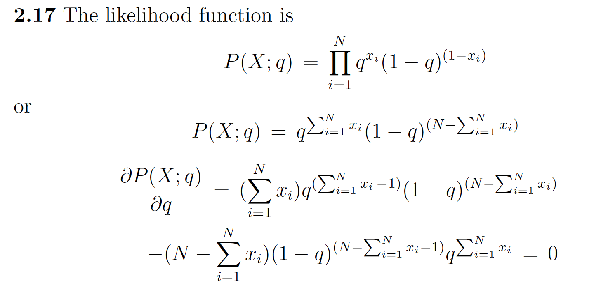
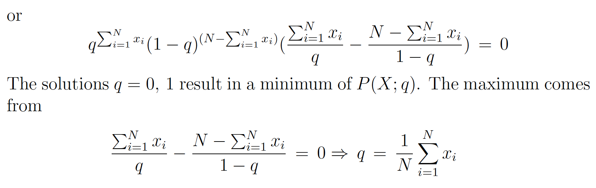
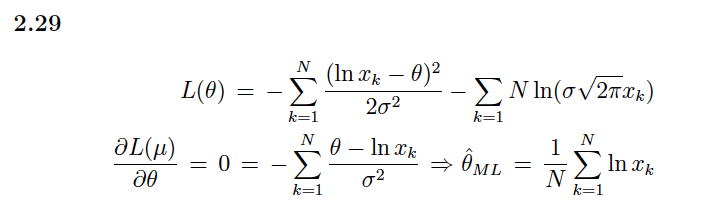
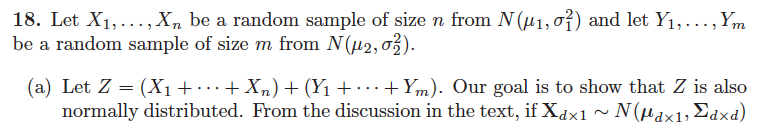
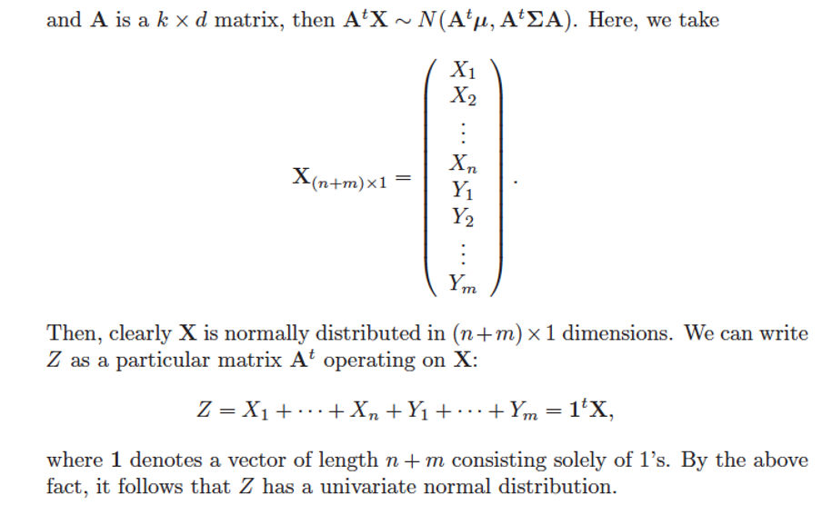
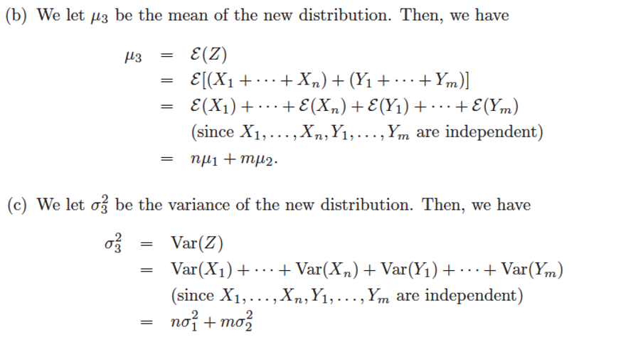
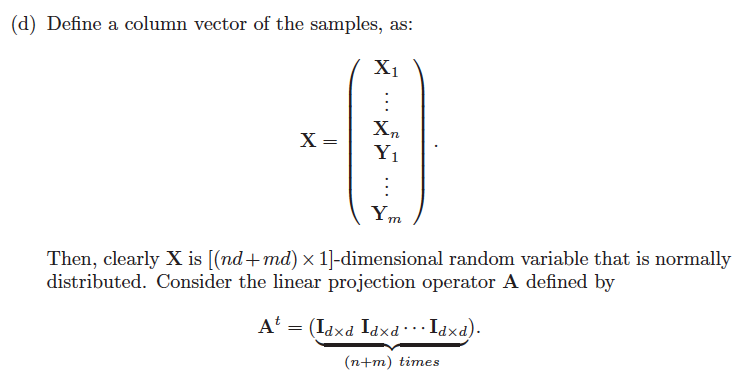
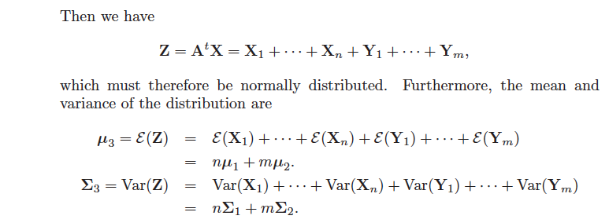
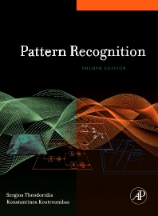

## **Problem 2.2**

In a two-class one-dimensional problem, the pdfs are the Gaussians $\mathcal{N}(0,\sigma^2)$ and $\mathcal{N}(1,\sigma^2)$ for the two classes, respectively. Show that the threshold $x_0$ minimizing the average risk is equal to
$$
x_{0}={1/2}-\sigma^2\ln\frac{\lambda_{21}P(\omega_2)}{\lambda_{12}P(\omega_1)}
$$
where $\lambda_{11}=\lambda_{22}=0$ has been assumed.

### Solution

In a two-class problem:

$$R(\alpha_1|x)=\lambda_{11}P(\omega_1|x)+\lambda_{12}P(\omega_2|x)$$

$$R(\alpha_2|x)=\lambda_{21}P(\omega_1|x)+\lambda_{22}P(\omega_2|x)$$

The threshold $x_0$ minimizing the average risk where $R(\alpha_1|x_0)=R(\alpha_2|x_0),$ then:

$$\lambda_{11}P(\omega_1|x_0)+\lambda_{21}P(\omega_2|x_0)=\lambda_{12}P(\omega_1|x_0)+\lambda_{22}P(\omega_2|x_0)$$

$$\Rightarrow\frac{P(\omega_1|x_0)}{P(\omega_2|x_0)}=\frac{p(x_0|\omega_1)P(\omega_1)}{p(x_0|\omega_2)P(\omega_2)}=\frac{\lambda_{12}-\lambda_{22}}{\lambda_{21}-\lambda_{11}}$$

To minimize the average risk, we have
$$\frac{P(x_0|\omega_1)}{P(x_0|\omega_2)}=\frac{\lambda_{12}-\lambda_{22}}{\lambda_{21}-\lambda_{11}}\frac{P(\omega_2)}{P(\omega_1)}$$
and $\lambda_{11}=\lambda_{22}=0$,then

$$\frac{P(x_0|\omega_1)}{P(x_0|\omega_2)}=\frac{\lambda_{12}}{\lambda_{21}}\frac{P(\omega_2)}{P(\omega_1)}$$

taking the logarithm of both sides,$$lnP(x_{0}|\omega_{1})-lnP(x_{0}|\omega_{2})=ln\frac{\lambda_{12}P(\omega_{2})}{\lambda_{21}P(\omega_{1})}$$

since $P(x_{0}|\omega_{1}){\sim}N(0,\sigma^{2}),$

$$P(x_{0}|\omega_{1})=\frac{1}{\sqrt{2\pi}\sigma}e^{-\frac{x_{0}^{2}}{2\sigma^{2}}}\quad\Rightarrow{lnP(x_{0}|\omega_{1})}=-ln(\sqrt{2\pi}\sigma)-\frac{x_{0}^{2}}{2\sigma^{2}}$$

and $P(x_{0}|\omega_{2}){\sim}N(1,\sigma^{2}),$

$$P(x_{0}|\omega_{2})=\frac{1}{\sqrt{2\pi}\sigma}e^{-\frac{(x_{0}-1)^{2}}{2\sigma^{2}}}\quad\Rightarrow{lnP(x_{0}|\omega_{2})}=-ln(\sqrt{2\pi}\sigma)-\frac{(x_{0}-1)^{2}}{2\sigma^{2}}$$

then, $lnP(x_0|\omega_1)-lnP(x_0|\omega_2)=-ln(\sqrt{2\pi}\sigma)-\frac{x_0^2}{2\sigma^2}-(-ln(\sqrt{2\pi}\sigma)-\frac{(x_0-1)^2}{2\sigma^2})$

$$lnP(x_0|\omega_1)-lnP(x_0|\omega_2)=-\frac{(x_0-1)^2}{2\sigma^2}-\frac{x_0^2}{2\sigma^2}=ln\frac{\lambda_{12}P(\omega_2)}{\lambda_{21}P(\omega_1)}$$

$$(x_{0}-1)^{2}-x_{0}^{2}=2\sigma^{2}ln\frac{\lambda_{12}P(\omega_{2})}{\lambda_{21}P(\omega_{1})}$$

$$x_{0}^{2}-2x_{0}+1-x_{0}^{2}=2\sigma^{2}ln\frac{\lambda_{12}P(\omega_{2})}{\lambda_{21}P(\omega_{1})}$$

$$-2x_{0}+1=2\sigma^{2}ln\frac{\lambda_{12}P(\omega_{2})}{\lambda_{21}P(\omega_{1})}$$

$$\mathrm{thus},\quad x_0=\frac{1}{2}-\sigma^2ln\frac{\lambda_{12}P(\omega_2)}{\lambda_{21}P(\omega_1)}$$

## **Problem 2.5**

Consider a two (equiprobable) class, one-dimensional problem with samples distributed according to the Rayleigh pdf in each class, that is,

$$
p(x|\omega_i)=\begin{cases}\frac{x}{\sigma_i^2}\exp\left(\frac{-x^2}{2\sigma_i^2}\right)&x\geq0 \\\ 0&x<0\end{cases}
$$

Compute the decision boundary point $g(x)=0.$

### Solution

The decision boundary point corresponds to

$$\frac{x_0}{\sigma_1^2}\exp(\frac{-x_0^2}{2\sigma_1^2})=\frac{x_0}{\sigma_2^2}\exp(\frac{-x_0^2}{2\sigma_2^2})$$

or by taking the logarithm

$$\frac{-x_0^2}{2\sigma_1^2}=\ln\frac{\sigma_1^2}{\sigma_2^2}-\frac{x_0^2}{2\sigma_2^2}$$

and finally

$$x_0=\sqrt{\frac{2\sigma_1^2\sigma_2^2}{\sigma_1^2-\sigma_2^2}\ln\frac{\sigma_1^2}{\sigma_2^2}}$$

## **Problem 2.7**

In a three-class,two-dimensional problem the feature vectors in each class are normally distributed with covariance matrix
$$
\Sigma=\begin{bmatrix}1.2&0.4 \\\ 0.4&1.8\end{bmatrix}
$$
The mean vectors for each class are $[0.1,0.1]^T,[2.1,1.9]^T,[-1.5,2.0]^T.$ Assuming that the classes are equiprobable,
(a) classify the feature vector [1.6,1.5]$^T$ according to the Bayes minimum error probability classifier;
(b) draw the curves of equal Mahalanobis distance from [2.1,1.9]$^{\acute{T}}.$

### Solution

(a) It suffices to compute the Mahalanobis distance of $[1.6,1.5]^T$ from mean vectors of the classes. We have:

$$\Sigma^{-1}=\left[\begin{array}{cc}0.9&0.2 \\\ -0.2&0.6\end{array}\right]$$

$$|\Sigma|=1.2\times1.8-0.4\times0.4=2,\Sigma^{-1}=\frac{1}{|\Sigma|}\Big[\begin{matrix}1.8&-0.4 \\\ -0.4&1.2\end{matrix}\Big]=\Big[\begin{matrix}0.9&-0.2 \\\ -0.2&0.6\end{matrix}\Big]$$

Thus, $d_1^2=2.361,d_2^2=0.241,d_3^2=9.416$

Hence $[1.6,1.5]^T$ is assigned to $\mathcal{w_2}$

(b) According to theory it suffices to compute the eigenvalues and eigenvectors of $\Sigma$. There are

$$\lambda_{1}=1,\lambda_{2}=2 \\\ v_{1}=[0.89,-0.45]^{T} \\\ v_{2}=[0.45,0.89]^{T}$$

Thus the ellipse, centered at $\mu_2$ and axis

$2\sqrt{\lambda_1}c\boldsymbol{v}_1$ and $2\sqrt{\lambda_2}c\boldsymbol{v}_2$

## **Problem 2.12**

Consider a two-class, two-dimensional classification task, where the feature vectors in each of the classes $\omega_1,\omega_{2}$ are distributed according to

$$p(x|\omega_1)=\frac{1}{\sqrt{2\pi\sigma_1^2}}\exp\biggl(-\frac{1}{2\sigma_1^2}(x-\mu_1)^T(x-\mu_1)\biggr)$$

$$p(x|\omega_2)=\dfrac{1}{\sqrt{2\pi\sigma_2^2}}\exp\biggl(-\dfrac{1}{2\sigma_2^2}(x-\mu_2)^T(x-\mu_2)\biggr)$$

with

$$\mu_{1}=[1,1]^{T},\mu_{2}=[1.5,1.5]^{T},\sigma_{1}^{2}=\sigma_{2}^{2}=0.2$$

Assume that $P(\omega_1)=P(\omega_2)$ and design a Bayesian classifier
(a) that minimizes the error probability
(b) that minimizes the average risk with loss matrix

$$\Lambda=\begin{bmatrix}0&1 \\\ 0.5&0\end{bmatrix}$$

Using a pseudorandom number generator, produce 100 feature vectors from each class, according to the preceding pdfs. Use the classifiers designed to classify the generated vectors. What is the percentage error for each case? Repeat the experiments for $\mu_{2}=[3.0,3.0]^{T}.$

### Solution

(a) For the two-class classification, if $P(\omega_1)=P(\omega_2)$ and $\lambda_{11}=\lambda_{22}=0$,

The Bayesian classifier is: $x\to\omega_{1}$ if $P(x|\omega_{1})>P(x|\omega_{2})\frac{\lambda_{12}}{\lambda_{21}}$

If $\lambda_{12}=\lambda_{21}$ , the Bayesian classifier minimizes the error probability. Thus, the Bayesian
classifier is: $x\to\omega_{1}$ if $P(x|\omega_{1})>P(x|\omega_{2})$

We have

$$p(x|\omega_1)=\frac{1}{\sqrt{2\pi\sigma_1^2}}\exp\biggl(-\frac{1}{2\sigma_1^2}(x-\mu_1)^T(x-\mu_1)\biggr)$$

$$p(x|\omega_2)=\dfrac{1}{\sqrt{2\pi\sigma_2^2}}\exp\biggl(-\dfrac{1}{2\sigma_2^2}(x-\mu_2)^T(x-\mu_2)\biggr)$$

From $\sigma_1^2=\sigma_2^2=\sigma^2,\|x-\mu_1\|^2=(x-\mu_1)^T(x-\mu_1)$ and $\|x-\mu_2\|^2=(x-\mu_2)^T(x-\mu_2)$, we have

$$P(x|\omega_1)=\frac{1}{\sqrt{2\pi\sigma^2}}\exp\left(-\frac{\|x-\mu_1\|^2}{2\sigma^2}\right),\quad P(x|\omega_2)=\frac{1}{\sqrt{2\pi\sigma^2}}\exp\left(-\frac{\|x-\mu_2\|^2}{2\sigma^2}\right)$$

$P(x|\omega_1)>P(x|\omega_2)$ is equivalent to $\ln P(x|\omega_1)>\ln P(x|\omega_2)$

$$\ln P(x|\omega_1)=\ln\frac{1}{\sqrt{2\pi\sigma^2}}-\frac{\|x-\mu_1\|^2}{2\sigma^2},\quad\ln P(x|\omega_2)=\ln\frac{1}{\sqrt{2\pi\sigma^2}}-\frac{\|x-\mu_2\|^2}{2\sigma^2}$$

$P(x|\omega_1)>P(x|\omega_2)$ is equivalent to $\|x-\mu_1\|<\|x-\mu_2\|$

Thus, for the Bayesian classifier minimizing the error probability is equivalent to the
classifier minimizing the Euclidean distance, namely,

$$x\to\omega_1\text{ if }\|x-\mu_1\|<\|x-\mu_2\|$$

(b) In this case, $x$ is classified to $P(x|\omega_{1})>P(x|\omega_{2})\frac{\lambda_{12}}{\lambda_{21}}$

where $\lambda_{12}=1$ and $\lambda_{21}=0.5$. Thus following similar arguments as in theory, for Bayesian
classification for normal distributions, we conclude that the decision hyperplane is

$$g_{12}(x)=w^T(x-x_0) \\\ w=\mu_{1}-\mu_{2}$$

and

$$x_0=\frac{1}{2}(\mu_1+\mu_2)-\sigma^2\ln\frac{\lambda_{21}P(\omega_1)}{\lambda_{12}P(\omega_2)}\frac{\mu_1-\mu_2}{\|\mu_1-\mu_2\|^2}$$

(c) The following MATLAB function takes as input the variance (s), the mean ( m) and the number of samples N. The output is a vector 1xN, whose ele- ments are the N samples of the 1-D Gaussian. For 2-D independent variables, combine two samples generated above, in a single vector

$$x=[x_1,x_2]^T$$

``` matlab title="matlab"
Function x=gaussian(m,s,N);
x=randn(1,N);
x=x*sqrt(s)+m;
```

## **Problem 2.17**

In a heads or tails coin-tossing experiment the probability of occurrence of a head (1) is $q$ and that of a tail (0) is $1-q$. Let $x_i,i =1,2,...,N$, be the resulting experimental outcomes, 𝑥𝑖 ∈ {0,1}. Show that the ML estimate of $q$ is

$$q_{ML}=\frac1N\sum_{i=1}^Nx_i$$

Hint: The likelihood function is

$$P(X;q)=\prod_{i=1}^Nq^{x_i}(1-q)^{(1-x_i)}$$

Then show that the ML results from the solution of the equation

$$q^{\sum_{i}x_{i}}(1-q)^{(N-\sum_{i}x_{i})}\left(\frac{\sum_{i}x_{i}}{q}-\frac{N-\sum_{i}x_{i}}{1-q}\right)=0$$

### Solution





## **Problem 2.29**

Show that for the lognormal distribution

$$p(x)=\frac{1}{\sigma x\sqrt{2\pi}}\exp\left(-\frac{(\ln{x}-\theta)^{2}}{2\sigma^{2}}\right),x>0$$

The ML estimate is given by

$$\theta_{ML}=\frac{1}{N}\sum_{k=1}^{N}\ln{x_k}$$

### Solution



## **Problem**

Consider two normal distributions in one dimension: $N(\mu_1,\sigma_1^2)$ and $N(\mu_2,\sigma_2^2).$ Imagine that we choose two random samples $x_1$ and $x_2$,one from each of the normal distributions and calculate their sum $x_3=x_1+x_2.$ Suppose we do this repeatedly.

(a) Consider the resulting distribution of the values of $x_3.$ Show from frst principles
that this is also a normal distribution.

(b) What is the mean,  $\mu_{3}$, of your new distribution?

(c) What is the variance, $\sigma_3^2?$

(d) Repeat the above with two distributions in a multi-dimensional space, i.e., $N(\mu_1,\Sigma_1)$ and $N(\mu_2,\Sigma_2).$

### Solution







## References



- Sergios Theodoridis Konstantinos Koutroumbas Pattern Recognition. 4th Edition. Springer, 2010.