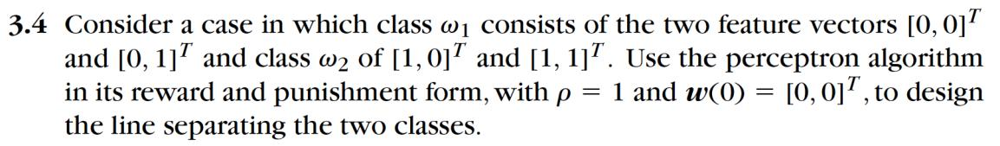
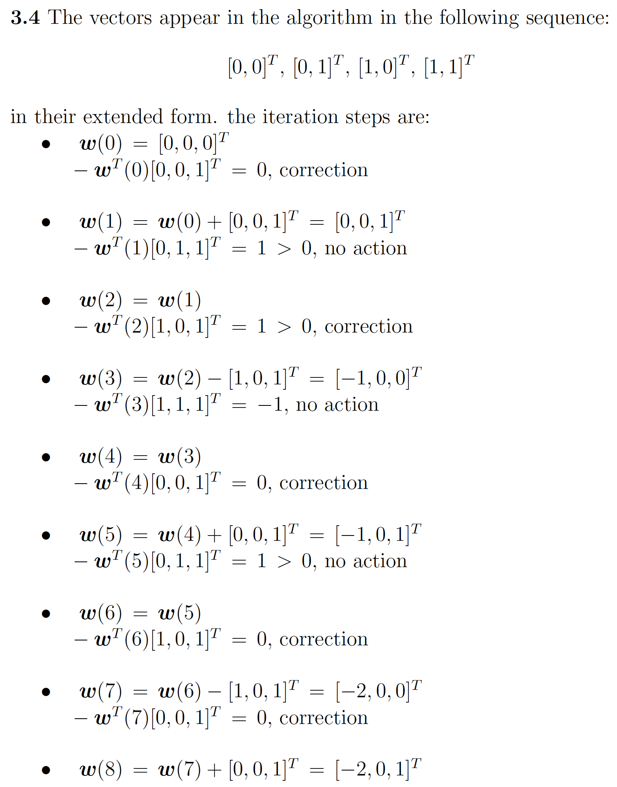
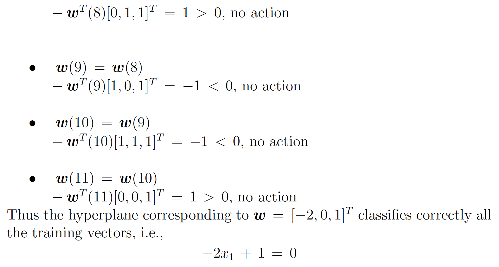

## Problem

Decision hyperplane:

$$g(x)=w^{T}x+w_{0}=0\Rightarrow w_{1}x_{1}+w_{2}x_{2}+\cdots+w_{l}x_{l}+w_{0}=0$$

where $w=(w_{1},w_{2},...,w_{l})^{T}$ is weight vector, $w_{0}$ is threshold

**Our goal:** compute a solution, a hyperplane $w$, so that

$$w^Tx+w_0>0(or<0),\quad x\in\omega_1(or \omega_2)$$

Perceptron algorithm：

- Define a cost function $J(w)$
- Chooses an algorithm to minimize $J(w)$
- The minimum corresponds to a solution

**Perceptron cost function：**

$$J(w)=\sum_{x\in Y}\delta_xw^Tx$$

- Y is the subset of the training vectors wrongly classified by $w$
- When 𝑌 = ∅, a solution is achieved and  $J(w) ≥ 0$
- $\delta_x=\begin{cases}-1& \text{if}x\in\omega_1 \\\ +1& \text{if}x\in\omega_2\end{cases}$
- $J(w)$ is continuous and piecewise linear

**Minimize the cost function:**

$$\frac{\partial J(w)}{\partial w}=\frac{\partial}{\partial w}\left(\sum_{x\in Y}(\delta_{x}w^{T}x)\right)=\sum_{x\in Y}\delta_{x}x$$

$$w(t+1)=w(t)-\rho_t\frac{\partial J(w)}{\partial w}\Bigg|_{w=w(t)}$$

$$w(t+1)=w(t)-\rho_t\sum_{x\in Y}\delta_xx$$

The perceptron algorithm converges in a finite number of iteration steps
to a solution if

$$\lim_{t\to\infty}\sum_{k=0}^t\rho_k\to\infty\quad\mathrm{and}\quad\lim_{t\to\infty}\sum_{k=0}^t\rho_k^2<+\infty $$

The perceptron algorithm is a reward and punishment scheme

## Solution

## References

- Sergios Theodoridis Konstantinos Koutroumbas Pattern Recognition. 4th Edition. Springer, 2010.
